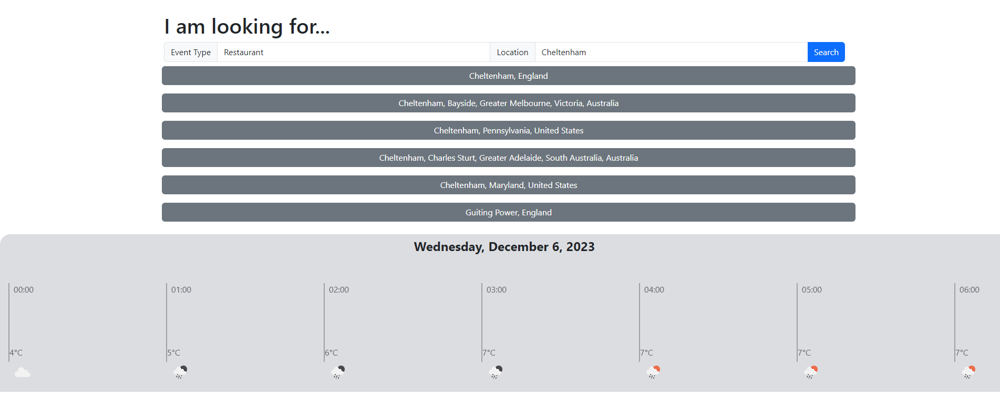
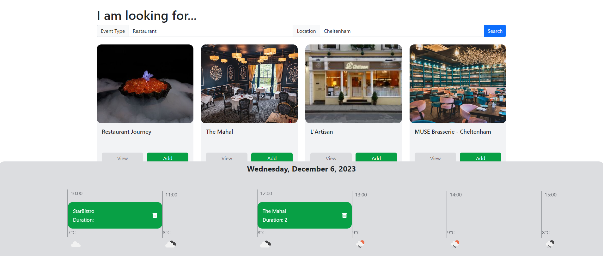

# NoFOMO
An app that takes away FOMO - An event planner for all your needs


## Description

This webpage provides combines a useful event search feature with a daily scheduler that allows you to plan out your day with confidence.

By leveraging APIs like Worldwide Restaurants, Trueway Places and OpenWeatherMap it allows you to find events/places to go, links to further information and weather icons showing the forecasted temperature and weather conditions at that time of day for that location.

## Table of Contents

Included for your ease of use is a table of contents

- [Installation](#installation)
- [Usage](#usage)
- [Credits](#credits)
- [Screenshots](#screenshots)
- [License](#license)

## Installation
  
If you wish to work on the files for this project you can clone it onto your machine.
  
```Git clone command```  
```
git clone git@github.com:kevinstaresdarbon/NoFOMO.git
```
  
if you simply wish to view and/or use the page you can use this link:  
[NoFOMO](https://kevinstaresdarbon.github.io/NoFOMO/)

## Usage
  
This webpage contains a one-page front-end that can be used to search for events by providing a location and a category. It provides cards for viewing the websites for returned places of interest and allows you to add them to the daily scheduler at the bottom of the page.
We would prefer that you do not clone this website or change any of the files in a local copy but just visit the page and supply your search conditions!  If you do clone the site for your use please provide your own API keys.
  
## Credits
    
This project is a collaboration between Anna Brisland, Janeks Takayama and Kevin Stares-Darbon.  
  
The template and advice for this README was taken from this site:  
<https://coding-boot-camp.github.io/full-stack/github/professional-readme-guide>  
  
## Screenshots  
  
Below are the screenshots of the finished challenge:
  
Above 1200px wide:  

  

  
## License  
  
MIT License citation is supplied [HERE](./LICENSE)
